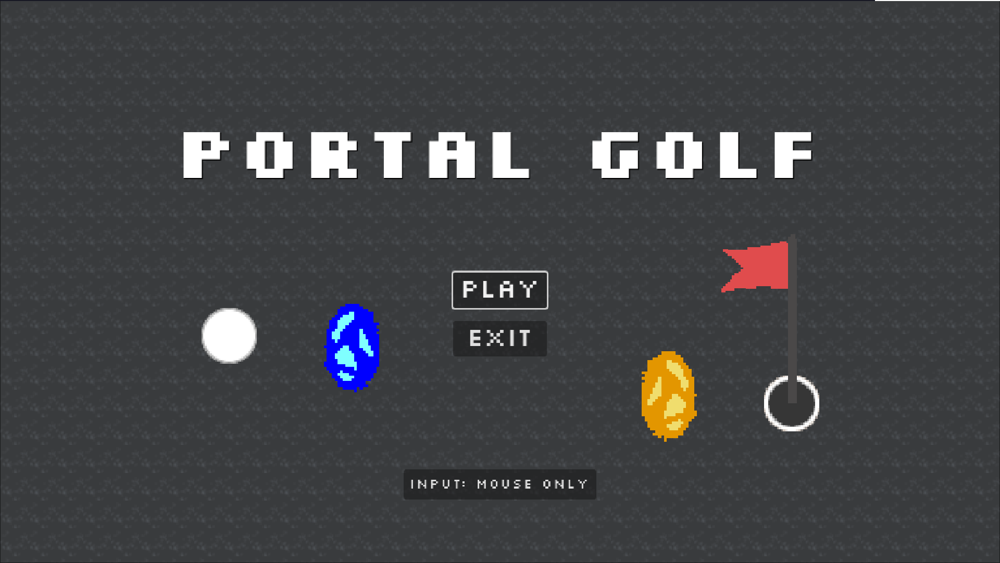

# Portal Golf

A simple 2D Godot game about mini golf and portals.

I made this for Hack Club's [Jumpstart V2](https://jumpstart.hackclub.com/).

## Screenshots

## ​Features:

- 5 levels
- every asset is made by me
- portals
- controller and mouse support
- background music (it's OK-ish but a bit annoying - I tried my best!)
- multiple obstacles! (water, mud, spinning thingy)
​
